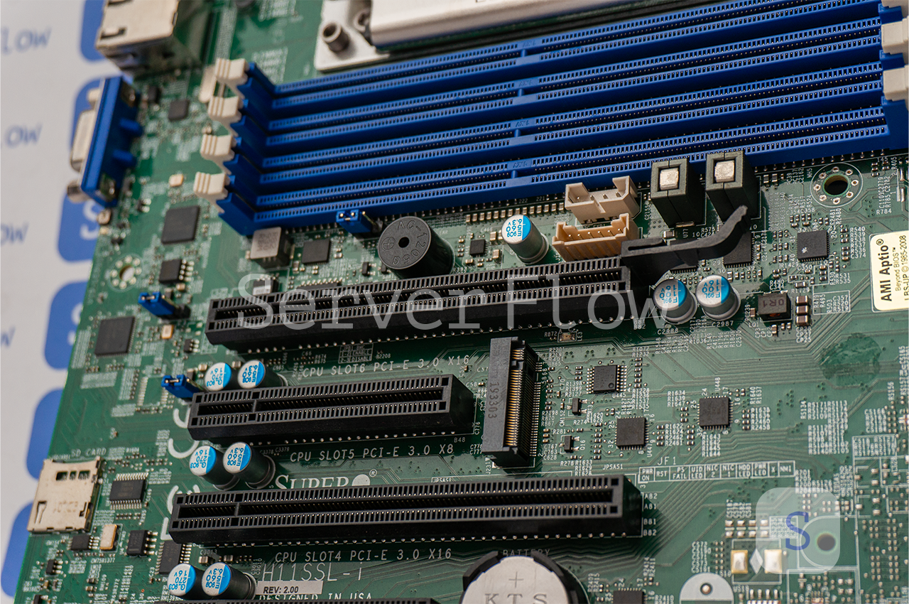
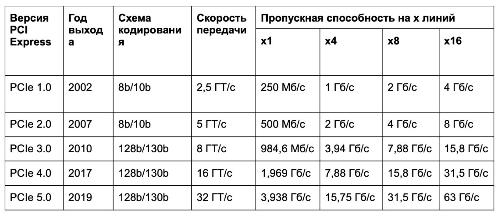
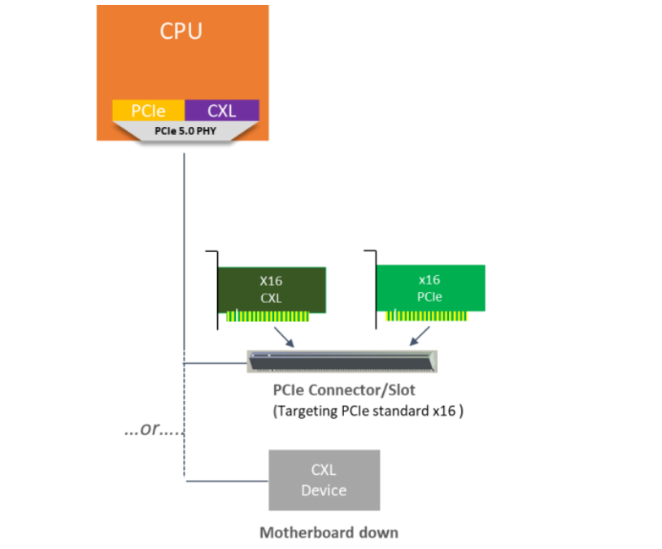
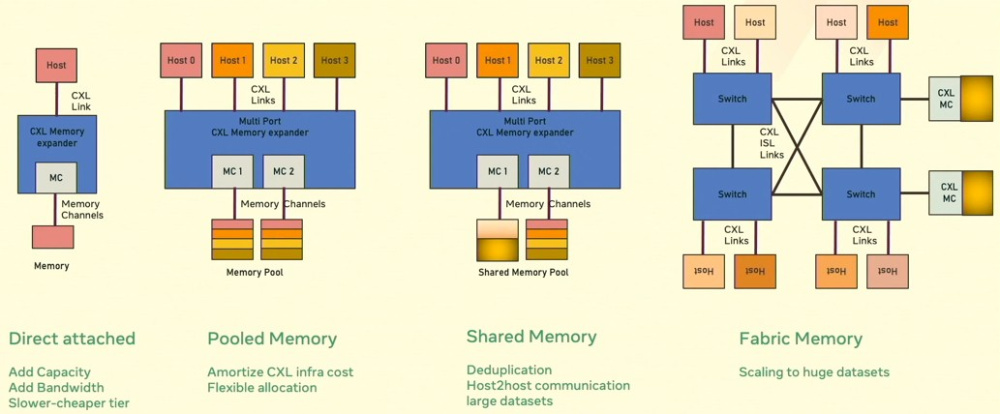
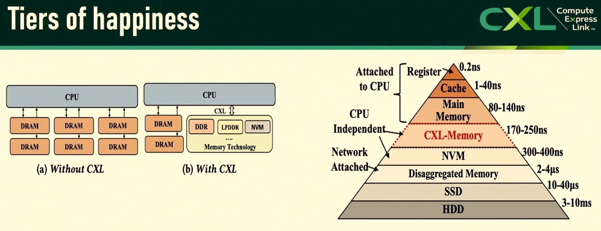

PCI Express (PCIe или PCI-E) - это компьютерная шина, в которой применяются высокопроизводительный протокол последовательной передачи данных и принцип соединения «точка-точка».

PCIe базируется на программной модели шины PCI и функционирует в полнодуплексном режиме, при котором информация передается на высоких скоростях в прямом и противоположном направлениях по независимым каналам. Такие каналы называются линиями PCIe, причем от числа линий (x1, x2, x4, x8, x16 и x32) напрямую зависит скорость работы и пропускная способность шины, измеряемая в гигатранзакциях в секунду (ГТ/с).
PCIe используют для подключения к материнской плате разнообразных внутренних плат расширения:
- видеокарт;
- звуковых карт;
- адаптеров Ethernet;
- адаптеров Wi-Fi и bluetooth
- NVMe SSD накопителей
- рейд контроллеров
- различных USB хабов
- сопроцессоров Intel Xeon Phi
- средств доверенной загрузки ПАК Соболь
- криптографических ускорителей

## Какие pci express бывают

Есть несколько вариаций PCI-Express (PCIe). По интерфейсу шины классифицируют на модификации:

В ближайшее время выпустят версию 6.0. Дополнительно при обозначении версий шин указывают число линий. Например, PCI-Express (PCIe) 4.0х16.

По количеству каналов шины PCI express бывают:
1. PCIeх1. Стандарт, снабженный только 1 линией, длина до 25 мм.
2. PCIeх4. Количество линий – 4, длина – 39 мм.
3. PCIeх8. Шина, у которой 8 линий, 56 мм в длине.
4. PCIeх16. У интерфейса 16 линий, в длину достигает 89 мм.

Наилучшим выбором для видеокарты почти всегда считается слот PCIeх16 в виду его пропускной способности. Если в ПК 2 и более графических процессоров, стоит на запас предусмотреть слот X16 или X8. Теперь чуть подробнее о каждой версии.
### PCIeх1
PCIeх1 – самый компактный слот. Демонстрирует быструю работу на материнских платах PCIe Gen 4.0 или 5.0, поэтому нередко применяется для работы с периферийными устройствами: wifi и bluetooth адаптеры, звуковые карты и т.д.  
### PCIeх4
Применяется преимущественно для обновленных версий устройств х1. Типичные примеры: сетевые карты, RAID-контроллеры требующие более производительного интерфейса передачи данных.
### PCIeх8
Особенность слота – значительное увеличение ширины шины, что приводит к расширению пропускной способности для карт high-end. Обычно PCI express х8 применяют в производительных контроллерах, а также в видеокартах начального уровня.
### PCIeх16
Самый большой и, как уже было отмечено, самый совершенный слот. Используется в видеокартах, сетевых картах серверного уровня. Обладает наивысшими скоростями передачи данных, обусловленными версией протокола.

## Принцип работы PCIe

Архитектура PCIe схожая с сетевым протоколом. Она тоже делится на несколько уровней:
1. Application Layer. Уровень, необходимый для пакетирования данных и их последующей передачи на следующей этап. Готовый пакет получает заголовок: Header+Data
2. Transaction Layer. Этап предусматривает проверку загруженных сведений на наличие или отсутствие искажений. Для этого система сверяет код данных с контрольным числом. Впоследствии код проверки ECRC добавляется к основному заголовку. 
3. Data Link Layer. Уровень, на котором пакету данных присваивают уникальный двухбайтовый номер (Sequence Number). Это нужно для сведения к нулю риска неудачной транспортировки данных. Дополнительно блок Header+Data+ECRC получает код LCRC. С его помощью удастся проверить целостность данных. В случае успешно пройденной проверки активируется сигнал ACK. Если передача оказалась ошибочной и были выявлены недочеты, активируется сигнал NAK. Тогда пакет отправляется на повторную передачу.
4. Physical Layer. Уровень, на котором происходит согласование приема пакета по протоколу PLP. Необходим для определения параметров полосы: от ширины до частоты для связи с другими устройствами.

Итоговая информация по стандарту имеет код: Header+Data+ECRC+LCRC. Ее дополнительно сопровождает стартовый байт, который нужен для уведомления принимающей стороны о начале блока данных. На конце стоит конечный байт, который уведомляет о завершении.

| Комплектующее                 | Типичное подключение | Количество PCIe-линий | Комментарий                       |
| ----------------------------- | -------------------- | --------------------- | --------------------------------- |
| **GPU (серверный)**           | PCIe slot            | **x16**               | Иногда x8, но почти всегда x16    |
| **HBA-контроллер (SAS/SATA)** | PCIe slot            | **x8**                | x4 редко, x8 — норма              |
| **RAID-контроллер**           | PCIe slot            | **x8 / x16**          | x16 — с кешем и высокой нагрузкой |
| **Сетевой адаптер 10GbE**     | PCIe slot            | **x4**                | Иногда x8                         |
| **Сетевой адаптер 25GbE**     | PCIe slot            | **x8**                |                                   |
| **Сетевой адаптер 40GbE**     | PCIe slot            | **x8**                |                                   |
| **Сетевой адаптер 100GbE**    | PCIe slot            | **x16**               |                                   |

## CXL
Compute Express Link (CXL) — это открытый стандарт межсоединения, который появился в 2019 году из-под крыла корпорации Intel.
**CXL — это тоже интерконнект. Более того, он использует физическую и электрическую основу PCIe, а сверху предлагает свои протоколы**. CXL работает, начиная с PCIe 5.0

Идея CXL была в том, чтобы развить уже знакомую всем экосистему PCIe, но добавить то, чего не хватало — когерентность кэша и трафика, пулы ресурсов и дезагрегрегацию.

Когерентность кэша и трафика в системе — когда все элементы системы (например CPU и GPU) работают с актуальными данными, даже если один из них внёс изменения. 
    Представьте, что несколько человек читают один и тот же документ: стоит кому-то поправить строку — обновлённая версия сразу появляется у всех остальных.

Интерфейс CXL в первую очередь предназначен для высокоскоростного соединения между центральным процессором и устройствами хранения данных с большой емкостью, что делает его особенно полезным в таких направлениях, как высокопроизводительные вычисления и дата-центры. Примечательно, что за основу открытого стандарта CXL взят его главный конкурент — закрытый стандарт PCIe, от которого первый унаследовал, последовательный интерфейс, а также различные протоколы передачи данных.

### Поколения CXL
- **CXL 1.0 (11 марта 2019 года)** — проверка концепций на базе PCIe 5.0. В июне 2019 года вышла CXL 1.1. Центральный процессор может взаимодействовать с общей памятью на устройствах-ускорителях через протокол когерентности кэша.
- **CXL 2.0 (10 ноября 2020 года)** — появились коммутация, масштабируемость, дезагрегация (общая память и хранилище), безопасность (защита и шифрование). Пропускная способность CXL 1.x (PCIe 5.0) сохранилась.
- **CXL 3.0 (2 августа 2022)** — основан на PCIe 6.0 и кодировании PAM-4, удвоена пропускная способность. Добавлены сетевые возможности с многоуровневым переключением для создания масштабируемых систем, поддержка разных типов устройств на одном порту, улучшена согласованность при прямом доступе и совместном использовании памяти (устройства могут напрямую обмениваться данными, минуя центральный процессор, что значительно снижает задержки).
- **Дальнейшее развитие** — **CXL 3.1 (14 ноября 2023)** и CXL 3.2 **(3 декабря 2024)** с улучшениями в управлении памятью (например, внедряет Hot-Page Monitoring Unit для иерархий памяти), оптимизированным мониторингом устройств, улучшенной поддержкой ОС и приложений, плюс повышенной безопасностью (Trusted Security Protocol), которая включает новые функции хранения метабитов, расширяет возможности защиты IDE и усиливает проверку совместимости, обеспечивая более ⁤безопасную среду‌ для приложений, работающих с конфиденциальными данными.
#### Принцип работы
**CXL** — это высокоскоростной открытый стандарт интерконнекта для когерентной связи CPU-устройств (например, ускорителей, GPU, SSD) и CPU-памяти (позволяя процессору использовать память устройств как свою собственную и наоборот).

**Важный момент — любое устройство CXL можно вставить в стандартный PCIe-слот** (начиная с версии 5.0), ведь у них одинаковые разъёмы и базовая технология передачи данных. Так что CXL — это дальнейшее развитие PCIe, но при этом отдельная ветвь эволюции.

Итак, CXL основан на физическом слое PCIe, но вводит три новых протокола:

- **Сначала** CXL.io— это, по сути, PCIe с некоторыми расширениями для работы в рамках CXL (например, новые типы транзакций для управления когерентностью на уровне протокола). Он не уступает в скорости PCIe и обеспечивает базовое взаимодействие. И да — CXL.io некогерентный. Одна физическая линия (lane) PCIe может нести трафик CXL.io, CXL.cache и CXL.mem одновременно, динамически распределяя полосу пропускания между ними, экономя ресурсы. PCIe так не умеет.
    
- **Дальше CXL.cache** — этот протокол позволяет ускорителям (типа GPU или NIC) кэшировать данные из памяти хоста прямо у себя, с низкой задержкой, чтобы поддерживать когерентность своего локального кэша. Это снижает трафик на шине. Задержки минимальны — в диапазоне 60-100 нс для доступа к кэшу устройства, что кардинально меньше, чем у традиционных механизмов с программным обеспечением когерентности (которые могут занимать микросекунды).
    
- **Наконец, CXL.mem** — он позволяет процессору хоста обращаться к памяти устройства как к своей собственной. Устройство выступает в роли агента памяти (Memory Device), и CPU использует обычные инструкции работы с памятью, как если бы это была его собственная DDR. Стандарт CXL изначально разрабатывался с учетом работы как с энергозависимой, так и с энергонезависимой памятью (Persistent Memory). В PCIe доступ к памяти устройства требует отдельного драйвера и происходит через барьеры и прерывания, что создает задержки и накладные расходы. CXL.mem интегрирует эту память в единое когерентное адресное пространство системы.

### Зачем CXL нужен
Количество каналов в контроллерах памяти не успевает за увеличением количества ядер в многоядерных процессорах. Процессорным ядрам может не хватать пропускной способности памяти, что сводит к минимуму преимущество в большом количестве ядер. Например, у Intel Xeon 6 до 288 ядер обслуживаются всего 12 каналами памяти — нагрузка распределяется крайне неравномерно.

1. Во-первых, объединение памяти (Memory Pooling) и дезагрегация (Disaggregation)

CXL позволяет превратить память из индивидуального ресурса каждого устройства в общий, динамически распределяемый пул, доступный всем компонентам системы. Это устраняет главную неэффективность традиционной архитектуры. К этому пулу по CXL могут обращаться все вычислительные узлы. Для них эта удалённая память выглядит и ведет себя **почти** как своя, локальная.

|                                                                                                                                                                                                                                                                                                                                                                                                                                                                                                                                                                                                                                                                                                                                                                                                               |
| ------------------------------------------------------------------------------------------------------------------------------------------------------------------------------------------------------------------------------------------------------------------------------------------------------------------------------------------------------------------------------------------------------------------------------------------------------------------------------------------------------------------------------------------------------------------------------------------------------------------------------------------------------------------------------------------------------------------------------------------------------------------------------------------------------------- |
| **Как объединение памяти работает на практике?**                                                                                                                                                                                                                                                                                                                                                                                                                                                                                                                                                                                                                                                                                                                                                              |
| **Проблема:** в современных системах процессор (CPU) и ускорители (GPU, FPGA, ASIC для AI/ML) имеют свою собственную изолированную память. Чтобы GPU что-то посчитал, CPU должен:  Скопировать данные из своей памяти в память GPU.Дождаться, пока GPU выполнит вычисления.Скопировать результаты обратно из памяти GPU в свою.  Этот процесс копирования создаёт задержки и накладные расходы даже на быстрых интерконнектах.  **Решение от CXL:** можно создать единое когерентное пространство памяти. Это значит, что CPU и GPU могут работать с одними и теми же согласованными данными в общей памяти без копирования.  CPU может подготовить данные в памяти.GPU получает к ним прямой доступ и начинает вычисления практически мгновенно.Результаты сразу видны и CPU, и GPU. |
2. Во-вторых, вышеупомянутая когерентность памяти и трафика

Это позволяет устройствам, например процессору и ускорителю, работать с одной и той же областью памяти без противоречий в данных (коллизий). Важно, что **это аппаратная когерентность**, и она работает без участия ядра ОС.

### Типы устройств CXL

**Type 1 — простые ускорители без своей памяти, наподобие Smart NIC.** Они используют только CXL.io и CXL.cache, чтобы кэшировать данные из хоста. Идеально для сетевых задач (парсинг, шифрование, фаерволы), где локальная память не нужна, а скорость доступа к данным CPU — очень даже.

**Type 2 — это многофункциональные устройства, вроде GPU, ASIC или FPGA.** Они работают по всем трём протоколам: CXL.io для базового обмена, CXL.cache для кэширования памяти хоста и CXL.mem для доступа к собственной памяти (например, GDDR или HBM). Здесь возможны два режима смещения: **device bias**, когда приоритет у устройства, и **host bias**, когда баланс сохраняется за хостом. На практике это удобно, например, при обучении нейросетей — GPU может напрямую обращаться к общему пулу памяти, минуя лишние копирования.

**Type 3 — это чистые расширители памяти без вычислительных блоков.** Они используют только CXL.io и CXL.mem и позволяют добавлять дополнительную память или persistent storage (хранит данные надёжно, как SSD или HDD, но быстро, например через NVDIMM, Intel Optane). По сути, это как внешний жёсткий диск, но с когерентным доступом и минимальными задержками. Основной сценарий — создание пулов памяти в дата-центрах, где, например, один модуль на 512 ГБ может обслуживать сразу несколько серверов.

https://itelon.ru/blog/cxl-pamyat-dlya-it-infrastruktury-nizhe-zaderzhki-vyshe-gibkost/