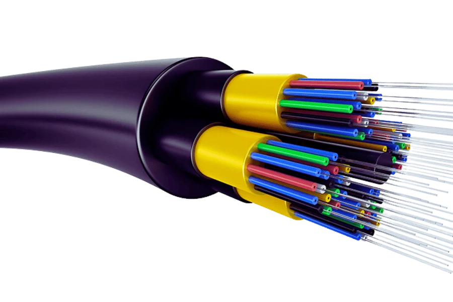
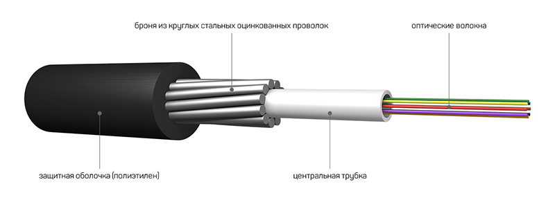
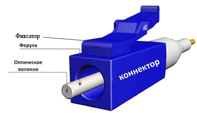
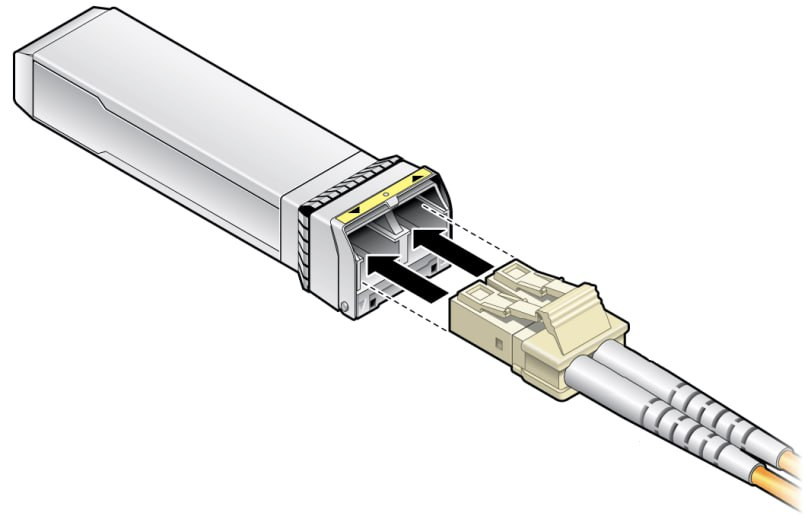
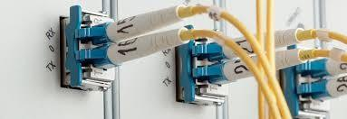

Оптоволокно кабель является передающей средой, субчастями которой являются тонкие стеклянные или пластиковые элементы, называемые оптическими волокнами, которые передают данные с помощью световой формы. Каждое волокно примерно такой же толщины, как волос отдельного человека, и большинство из них физически удерживаются внутри одного гибкого покрытия снаружи. Это также объяснило бы причину и принцип, лежащий в основе всей инженерии: сигнал через волокно как свет, который направляется вниз к волокну с помощью полного внутреннего отражения. Этот метод позволяет передавать свет на более необычайные расстояния с очень малой потерей мощности, что делает разумным отправлять и обрабатывать огромные объемы информации за одну секунду. По сравнению с обычными медными проводами, волоконно-оптические кабели не подвержены воздействию электромагнитных помех, имеют большую пропускную способность и позволяют передавать данные гораздо быстрее на большие расстояния, что делает их более эффективными в современных системах связи.

Состоят из:
- сердечника, изготавливаемая из стекла или пластика, где распространяется свет
- оболочка, находящаяся вокруг сердечника, показатель преломления небольшой, поэтому свет удерживается за счет полного внутреннего преломления
- буферное покрытие для защиты от влаги, ударов

Передача происходит с помощью преобразования электрического сигнала в свет с помощью лазера или светодиодного источника. Далее свет запускается в сердцевину, свет передается с помощью отражения, принимающий конец использует фоторедактор для принятия светового сигнала и преобразования обратно в электрические сигналы. 

## Одномодовое и многомодовое волокно: основные различия
Из двух основных типов оптических волокон, используемых для передачи данных, одномодовое волокно и многомодовое волокно являются различными типами оптических волокон, представляющими различные свойства и применения. Одномодовое волокно имеет тонкую сердцевину, в большинстве случаев от 8 до 10 микрометров, и это сужение сердцевины имеет познавательное значение, поскольку свет должен передаваться по волокну. Таким образом, такое волокно может обеспечить гораздо лучшую пропускную способность для передачи данных на большие расстояния без искажений и очень подходит для дальней телекоммуникации и соединения в центрах обработки данных.

В отличие от этого, многомодовый тип волокна обычно имеет больший диаметр сердцевины, который может быть около 50-62.5 микрометров, что позволяет нескольким световым лучам проходить внутри сердцевины. Единственным недостатком этой конфигурации является то, что существует ограничение на то, насколько большой диапазон пропускания и расстояние, на которое может передаваться сигнал без рассеивания сигнала. По этой причине, многомодовые оптоволоконные кабели предпочтительны в приложениях с передачей данных на небольшие расстояния, например, в офисах или кампусах, где требуются большие объемы данных на коротких расстояниях.

Наиболее важными характеристиками, которые следует учитывать при выборе одномодового или многомодового волокна, являются требования к пропускной способности и расстоянию, а также ограничения по стоимости. Одномодовое волокно предпочтительнее для приложений WAN на большие расстояния. Напротив, многомодовое волокно может быть развернуто в основном в локальных сетях (LAN), поскольку оно имеет более дешевые варианты развертывания для меньшего количества жил.

## Коннектор

Оптический коннектор (разъем) – это кабельное окончание. Коннектор устанавливается по обе стороны любого оптического кабеля, будь то магистральный или распределительный кабель, или даже соединительный патч корд. Существует большое множество различных типов оптических разъемов, отличающихся по конструктивному исполнению, способу фиксации, диаметру ферулы типу полировки и т.д.

## Типы оптических разъемов

По конструктивному исполнению наиболее популярными типами являются коннекторы FC, SC, LC и ST типа. Рассмотрим их отличия.

### Оптический коннектор SC
SC коннекторы – одни из наиболее применяемых разъемов. Они имеют пластиковый корпус прямоугольного сечения и ферулу диаметром 2,5 мм. К преимуществам оптического SC разъема можно отнести простоту коммутации. Для фиксации в розетке достаточно просто вставить его до щелчка. Аналогично производится и его извлечение. Вместе с тем, он плохо адаптирован к механическим и вибрационным нагрузкам.

###  Оптический коннектор LC
LC разъем по форме и принципу коммутации напоминает рассмотренный выше SC коннектор. Однако он имеет существенно меньшие габариты корпуса, да и ферула у него диаметром всего 1,25 мм. Компактный размер оптического LC разъема позволяет существенно повысить плотность портов на кроссе. Вместе с тем, из-за недостаточного пространства усложняется коммутация. При большой плотности портов коммутацию удобно выполнять только при помощи специализированного инструмента

### Оптический коннектор FC
FC разъем по праву считается самым надежным из перечисленных выше оптических коннекторов. Он имеет металлический корпус и фиксируется в розетке при помощи резьбового соединения. Последнее придает такому соединению механической прочности и вибрационной устойчивости. Но в удобстве коммутации он явно проигрывает. Оптические разъемы FC по умолчанию устанавливаются на все измерительные приборы для ВОЛС.

### Оптический коннектор ST
ST разъем на данный момент считается уже устаревшим, однако до сих пор применяется в многомодовых системах передач. Его фиксация напоминает фиксацию байонет разъема (вставить и немного провернуть по часовой стрелке). В отличие от остальных типов коннекторов, ферула коннектора ST имеет только UPC полировку.

## Трансивер
Активное сетевое оборудование оснащается оптическими портами, обеспечивающими передачу и прием данных по оптоволоконным линиям связи. Функционально каждый порт представляет собой приемопередатчик (англ. transceiver – трансивер) с разъемами для подключения волоконно-оптического кабеля (патч-корда)

Оптический трансивер состоит из нескольких функциональных узлов, размещаемых на печатной плате (PCB):

- лазерное передающее устройство;
- приемник на основе фотодиода;
- преобразователи сигналов;
- модулятор и демодулятор;
- усилители;
- чип памяти ПЗУ;
- схема термостабилизации.

