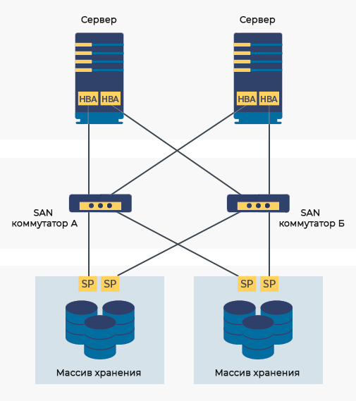
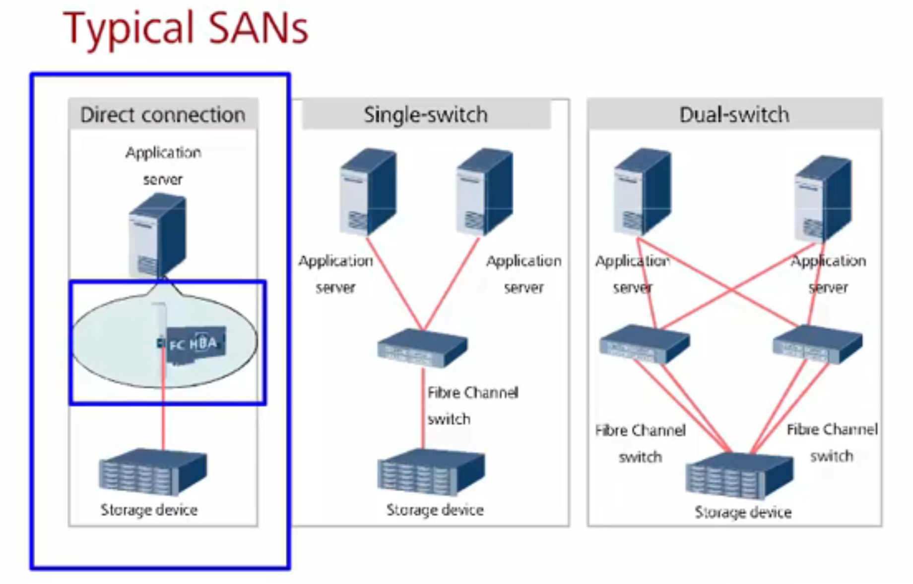
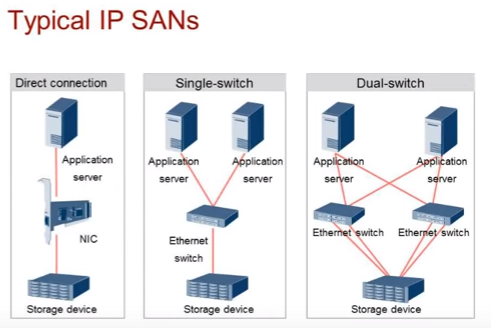

SAN (Storage Area Network) — это выделенная, высокоскоростная сеть, которая соединяет серверы с устройствами хранения данных (дисковыми массивами, ленточными библиотеками) . Ее главная особенность в том, что для операционной системы сервера диски, предоставленные по SAN, выглядят и работают так, как будто они подключены к нему локально (например, как внутренний SCSI или SATA-диск)
Ключевое слово здесь — **блочный доступ**. SAN оперирует сырыми блоками данных. Это отличает её от NAS (Network Attached Storage), где доступ осуществляется на уровне файлов и папок по протоколам вроде NFS или SMB/CIFS

Storage Area Network (SAN) - это специальная выделенная сеть, объединяющая устройства хранения данных с серверами приложений, обычно строится на основе протокола Fibre Channel, либо на набирающем обороты протоколу iSCSI. В отличие от NAS, SAN не имеет понятия о файлах: файловые операции выполняются на подключенных к SAN серверах. SAN оперирует блоками, как некий большой жесткий диск. Идеальный результат работы SAN - возможность доступа любого сервера под любой операционной системой к любой части дисковой емкости, находящейся в SAN. Оконечные элементы SAN - это серверы приложений и системы хранения данных (дисковые массивы, ленточные библиотеки и т. п.). А между ними, как и в обычной сети, находятся адаптеры, коммутаторы, мосты, концентраторы.  

## Из чего  состоит
**1. Уровень серверов (Инициаторы)**  
На этом уровне находятся серверы, которым нужен доступ к данным. Для подключения к SAN в них устанавливаются специальные платы - **HBA (Host Bus Adapter)**. Для сетей Fibre Channel это специальные оптические адаптеры. Для iSCSI это могут быть обычные сетевые карты (NIC).
**2. Уровень сети (Фабрика)**  
Это сердце SAN — инфраструктура, которая соединяет серверы и хранилища. Она состоит из - **коммутаторов (Switches)**. Основной элемент современных SAN. Они направляют трафик между людьми сети. В Fibre Channel SAN группа связанных коммутаторов называется **Fabric** (фабрика).  **FC коммутаторы** имеют порты под SFP FC (или gbic/xfp). Только в редких случаях порты бывают не SFP, а с жесткой заточкой под определенный тип FC. 
**3. Уровень хранения (Цели - Targets)**

### Как работает
1. Сервер (инициатор) через HBA посылает команду на чтение блока данных.
2. Коммутатор SAN (фабрика) получает эту команду и, основываясь на адресе, перенаправляет её на нужный порт дискового массива (цели).
3. Дисковый массив находит нужный блок на своих дисках и отправляет его обратно по тому же пути серверу.
4. Весь этот процесс происходит на очень высокой скорости и с минимальными задержками, так как сеть SAN спроектирована специально для этой задачи и не загружена другим трафиком.
## Преимущества
- **Высокая производительность:** SAN выдаёт отличную производительность и быстрый доступ к данным (благодаря Fibre Channel или iSCSI). Поэтому отлично подходит для требовательных приложений, вроде баз данных и виртуализации.
- **Надёжность и отказоустойчивость:** В SAN можно реализовать механизмы отказоустойчивости на уровне оборудования (дублирование комплектующих), на программно-аппаратном (геораспредение, кластеризация, RAID, интеллектуальные системы маршрутизации) и на уровне сети (многоканальность, резервирование сетевого канала, сквозной доступ). 
- **Гибкость и масштабируемость:** SAN позволяет легко расширять хранилище, добавлять новые устройства и/или масштабировать старые.
- **Централизованное управление:** Можно управлять огромной SAN централизованно — без физического доступа к отдельным нодам сети.

## Недостатки
- **Высокая стоимость:** Особенно для Fibre Channel SAN. Специализированные коммутаторы, HBA-адаптеры и оптика стоят значительно дороже Ethernet-оборудования
- **Сложность:** Проектирование, внедрение и администрирование SAN требует глубоких знаний и высокой квалификации инженеров

## Протоколы
 - iSCSI, Fiber Channel. 
## **Fibre Channel**

**Fibre Channel (FC)** – стек протоколов типа TCP/IP. Правильно писать именно Fibre channel, а не Fiber. Есть теория, что так, потому что стандарт, в теории, поддерживает медные кабеля, помимо по факту везде используемых оптических.

FC описан в ряде стандартов, внизу скрин со стандартами в зависимости от уровня имплементации.
В стеке FC 5 уровней с похожей на TCP/IP схемой инкапсуляции:
- **FC-0** – физика и сигнализация
- **FC-1** – кодирование и декодирование
- **FC-2** – соглашения по структуре данных
- **FC-3** – сервисы – мало используется
- **FC-4** – взаимодействие FC с другими высокоуровневыми протоколами – SCSI-3 (в основном) или IP, ATM. То есть FC может транспортировать IP-пакеты, а не только IP может FC-кадры переносить 

**Адресация**
Каждое устройство в сети Fiber Channel имеет уникальный номер WWN. WNN бывает двух видов, под оба выделено 64 бита, со своей частью под Vendor ID:
**WWNN (World Wide Node Name)** – идентификация хоста в FC сети.
**WWPN (World Wide Port Name)** – идентификация конкретного порта на конкретном хосте в FC сети. Применение похоже на применение MAC-адреса в сети Ethernet.

**Логические топологии**
В сетях FC бывают три варианта топологий:
- **Point-to-point** – прямое подключение двух устройств
- **Arbitrated loop** – кольцо FC через FC-хабы с возможностью подключения до 27 устройств. Старая схема, проблемы со скоростью и доступом к среде, малое количество устройств. В текущий момент не используется.
- **Switched fabric** – коммутируемая среда через FC-коммутаторы, вытеснило loop. До 16 миллионов устройств и 239 коммутаторов в одной FC сети.

    

FC коммутаторы имеют поддержку **Zoning** – зонирование сети FC, что-то типо VLAN на Ethernet коммутаторах. Позволяет делить сеть FC на отдельные участки. Используется для упрощения администрирования, улучшения безопасности, увеличения производительности. Одно устройство может входить сразу в несколько зон.

Есть **два основных режима зонирования**:
- **зонирование по портам** или **жесткое зонирование** (port zoning/hard zoning) – порты закрепляются за зонами. Сопоставление port-zone настраивается на FC коммутаторе. Прямые операции по адресу между устройств разных зон запрещаются.
- **зонирование по имени** или **мягкое зонирование** (WWN zoning/soft zoning) – на основе WWNN серверу назначается зона. Сопоставление WWN-zone настраивается на FC коммутаторе. Прямые операции между устройств разных зон не запрещаются. Удобно использовать при частых подключениях устройств в разные порты. **alias zoning** – простой в настройке подвид soft zoning, WWNN для удобства сопоставляется придуманный тобой alias.

## iSCSI
**IP SAN** – способ построения сети хранения поверх транспортной сети TCP/IP (на L2 может быть Ethernet или даже Wi-Fi). Для реализации IP SAN чаще всего используется протокол iSCSI. **SCSI** – де факто отраслевой стандарт передачи данных между приложением и СХД, а **iSCSI** (internet SCSI) позволил использовать его в IP сетях. iSCSI описывает инкапсуляцию команд SCSI в сеть TCP/IP.

**Преимущества IP SAN**
- Стандартизация – отказ от FC: не нужны FC коммутаторы/FC HBA (не всегда, подробнее ниже) и вообще изучать FC
- Передача данных на большое расстояние – по сути, по всему миру
- Простое управление за счет использования IP – больше квалифицированного персонала и инструментов
- Масштабирование полосы пропускания с бОльшим потенциалом, чем FC (10/40/100G Ethernet в отличии от 16GB FC)
**Недостатки** **IP SAN**
- Безопасность данных при передаче
- TCP накладывает большие издержки из-за его обработки на CPU (далеко не всегда, TCP offload не новая штука давно, подробнее ниже)
- Хуже в сравнении с FC SAN справляется с задачами больших блоков данных из-за мелких пакетов и большой издержки на заголовки (тут может помочь FCoE, о нем тоже ниже)
Как работает:
1. Хост взаимодействует с устройством хранения, используя SCSI команды. iSCSI инкапсулирует SCSI команды и блоки данных в TCP пакеты для передачи по Ethernet+IP сети.
2. iSCSI initiator для взаимодействия с удаленной стороной (iSCSI target) кладет обычные SCSI команды и блоки данных в iSCSI пакеты и затем в TCP для транспорта по IP сети.
3. В iSCSI есть своя адресация отличная от адресации SCSI и TCP/IP, формат ее похож на доменный: iqn.1992-01.com.example – буквы IQN (iSCSI Qualified Names) далее группа цифр в виде года и месяца регистрации доменного имени, далее окончание домена.

Основные компоненты IP SAN:
- интерфейсные модули (NIC, iSCSI HBA) – обычно подключаются в PCI-e интерфейс на сервере/контроллере СХД
- Ethernet коммутаторы – обычные
- СХД с поддержкой iSCSI

**Интерфейсные модули** бывают трех вариантов (на серверах и СХД):
- NIC + программа initiator iSCSI – самая простая реализация и низкая стоимость, но нагрузка на CPU. 
- TOE NIC + программа initiator iSCSI – специализированная плата с TCP/IP Offload (часто уже есть в обычных NIC)
- iSCSI HBA – аппаратная NIC с поддержкой iSCSI и TCP/IP Offload

**Сравнение FC SAN с IP SAN**

| **Индикатор**                                                  | **FC SAN**                                                                                           | **IP SAN**                                                                                   |
| -------------------------------------------------------------- | ---------------------------------------------------------------------------------------------------- | -------------------------------------------------------------------------------------------- |
| **Макс. скорость**                                             | 16 Gbit/s                                                                                            | 10, 40, 100 Gbit/s                                                                           |
| **Сет. архитектура**                                           | отдельная сеть FC                                                                                    | существующая или отдельная IP сеть                                                           |
| **Расстояние**                                                 | ограничено оптической сетью FC SAN (можно поставить промежуточный FC свич, но это не сильно поможет) | не ограничено                                                                                |
| **Управление**                                                 | сложное (в том числе знающий персонал)                                                               | простое                                                                                      |
| **Совместимость (гетерогенность)**                             | плохая (очень сложно или невозможно использовать оборудование разных производителей)                 | хорошая (оборудование разных производителей часто полностью совместимо)                      |
| **Производительность**                                         | хорошая                                                                                              | хорошая – тут неоднозначано, полоса хорошая, но проблемы с накладными расходами при передаче |
| **Стоимость**                                                  | очень высокая (в том числе на обучение персонала)                                                    | низкая                                                                                       |
| **Стоимость реализации отказоустойчивости в случае катастроф** | высокая                                                                                              | низкая                                                                                       |
| **Безопасность**                                               | высокая (авторизация устройств)                                                                      | низкая                                                                                       |
