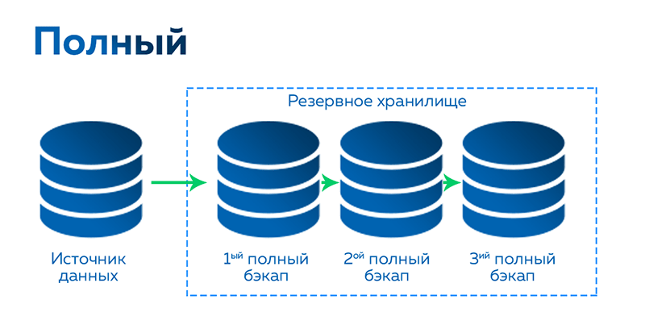
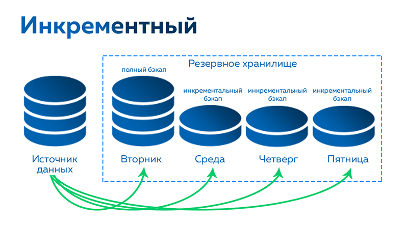
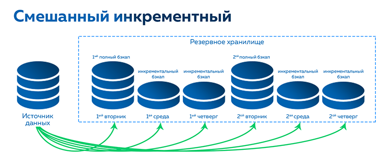

### Полное резервное копирование
Каждый раз при выполнении задачи бэкапа из источника копируются все данные без изъятия. Этот тип резервного копирования наиболее медленный, но обеспечивает наибольшую полноту и точность сохранения данных. 

### Преимущества Full Backup:
- быстрое восстановление данных
- простое управление
- все данные содержаться в одной резервной копии

### Недостатки Full Backup:
- требует много места для хранения резервных копий
- высокая загрузка сети
- длительное выполнение резервного копирования
- поскольку каждый файл бэкапа содержит весь набор данных (которые нередко являются конфиденциальными), под удар может попасть весь бизнес, если к ним получат доступ злоумышленники. Хотя этого риска можно избежать с помощью шифрования, если выбранное вами решение такую опцию поддерживает.
### Инкрементальное резервное копирование 
При таком типе бэкапа первый раз выполняется полное копирование, а каждый последующий раз копируются только новые или изменившиеся файлы с момента последней операции бэкапа. Данный тип копирования наиболее эффективен там, где нужно следить за историей версий: копирование рабочих документов, проектов, отчётов и т.д. 

Инкрементальное копирование с временными метками — разновидность инкрементального бэкапа, при котором каждая новая копия (инкремент) снабжается меткой, содержащей информацию о времени создания копии, для простоты автоматической обработки.  
  

На практике:
- Первый день. Делаете полный бэкап.
- Второй день. Создаете копию изменений за прошедший день.
- Третий день. Копируете измененные данные еще за одни сутки.
- Четвертый день. Снова копируете только ту информацию, которая претерпела изменения за последние сутки.
- Пятый день. Делаете полный бэкап.

  Если хотя бы один бэкап в цепочке будет отсутствовать или поврежден, восстановления будет невозможным. Поэтому цепочку инкрементных резервных копий не следует делать очень длинной. А период создания полных резервных копий необходимо выбирать в зависимости от частоты инкрементного резервного копирования

Но чтобы восстановить полностью данные с нуля мы должны сначала восстановить данные с полного бэкапа, а потом поочередно восстанавливать данные в том же порядке, в котором они создавались

Также если утрачен бэкап например с  4го дня, то и бэкапы с других дней будут также утрачены
Преимущества:  
- задачи резервного копирования выполняются быстро, поскольку в бэкап отправляются только изменения;
- требуется меньше пространства хранилища;
- частота выполнения может быть любой, каждый инкремент выступает отдельной точкой восстановления; 
Недостатки:  
  - медленный процесс полного восстановления, поскольку необходимо сначала вернуться к изначальному полному бэкапу, а затем пройтись по всем следовавшим за ним инкрементам;
- успешное восстановление данных зависит от целостности всех инкрементов в цепочке.
### Дифференциальное резервное копирование
При этом методе в первый раз выполняется полный бэкап, а при последующих операциях задача копирует только обновлённую информацию, включая данные, изменившиеся по сравнению с полным бэкапом (а не с предыдущим бэкапом, как при инкрементальном копировании).  

На практике:
- Первый день. Создаете полный бэкап.
- Второй день. Добавляете изменения за прошедшие сутки.
- Третий день. Снова добавляете копии новых данных, но уже за первый и второй день.
- Четвертый день. Делаете бэкап данных за первый, второй и третий день.
- Пятый день. Снова создаете полный бэкап данных.

  
Дифференциальная резервная копия позволяет быстрее восстанавливать данные по сравнению с инкрементным резервным копированием, поскольку для этого требуется всего две части резервной копии: полная резервная копия и последняя дифференциальная резервная копия.

Для восстановления надо сначала восстановить полный бэкап, а после любую из копий данных
#### Преимущества Differential Backup:
- Дифференциальное резервное копирование быстрее, чем полное, но медленнее, чем инкрементное
- Восстановление быстрее, чем инкрементное, но медленнее чем полное
- Дифференциальное резервное копирование надежнее, чем инкрементное (для восстановления требуется только полная и последняя резервная копия)
#### Недостатки Differential Backup:
- Каждый новый дифференциальный бэкап требует больше времени и места для хранения, чем предыдущий

### ОБРАТНОЕ ИНКРЕМЕНТНОЕ РЕЗЕРВНОЕ КОПИРОВАНИЕ

